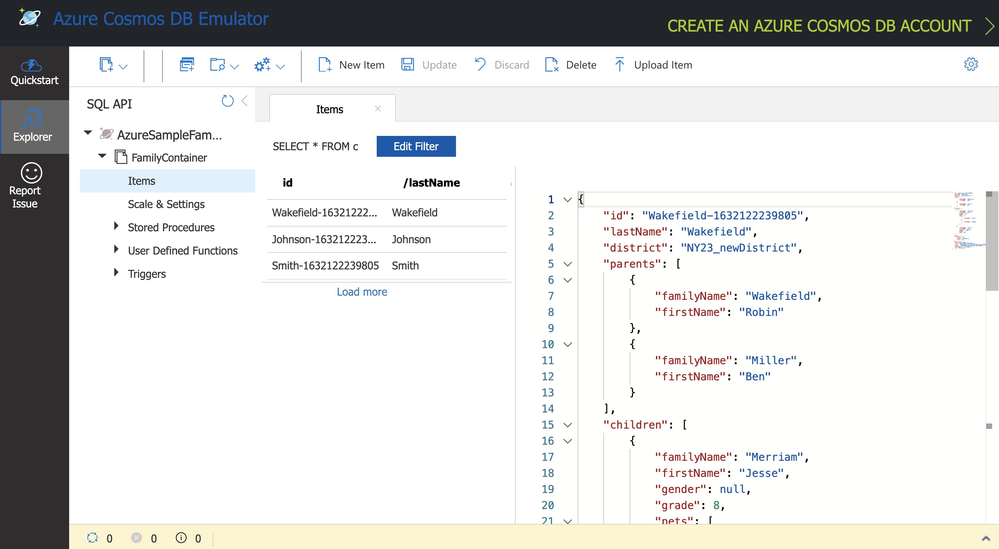

# Azure Cosmos DB local dev experience with VS Code devcontainers

This sample demonstrates how to enhance your local development experience with [Azure Cosmos DB Linux Emulator](https://docs.microsoft.com/en-us/azure/cosmos-db/linux-emulator?tabs=ssl-netstd21) and [VS Code devcontainers](https://code.visualstudio.com/docs/remote/containers).

**Before you begin**: Make sure to follow the instructions outlined in the [Getting started](https://code.visualstudio.com/docs/remote/containers#_getting-started) section in "Developing inside a Container". This includes setting up Visual Studio Code, OS specific requirements, Docker (and Docker compose), and [VS Code Remote Development extension pack](https://marketplace.visualstudio.com/items?itemName=ms-vscode-remote.vscode-remote-extensionpack)

### To run the example:

Start by cloning this repository:

```bash
git clone https://github.com/Azure-Samples/cosmosdb-java-devcontainers-demo
```

Open Visual Studio Code, press `F1` and select the `Remote-Containers: Open Folder in Container...` command. Select the project folder you just cloned and wait for the container to start.


>  The dev container will be built the first time you open it - opening the folder after the first successful build will be much quicker.

[To try out the CRUD operations quick start](https://github.com/Azure-Samples/cosmosdb-java-devcontainers-demo/blob/main/src/main/java/com/azure/cosmos/examples/crudquickstart/sync/SampleCRUDQuickstart.java), run the following command in the VS Code terminal:

```bash
mvn clean package && mvn exec:java -Dexec.mainClass="com.azure.cosmos.examples.crudquickstart.sync.SampleCRUDQuickstart" -DACCOUNT_HOST=https://localhost:8081/ -DACCOUNT_KEY=C2y6yDjf5/R+ob0N8A7Cgv30VRDJIWEHLM+4QDU5DE2nQ9nDuVTqobD4b8mGGyPMbIZnqyMsEcaGQy67XIw/Jw==
```
> `localhost:8081` is the endpoint for Azure Cosmos DB Emulator


Once the Maven dependencies are downloaded, the program will create database, container and execute CRUD operations. Browse to https://localhost:8081/_explorer/index.html to check the Azure Cosmos DB Emulator portal.




This is a derived version of the [sample code repo for Azure Cosmos DB Java SDK for SQL API](https://github.com/Azure-Samples/azure-cosmos-java-sql-api-samples) to show local development experience with [VS Code devcontainers](https://code.visualstudio.com/docs/remote/containers). Couple of changes have been made for this sample:

- [crudquickstart.sync.SampleCRUDQuickstart.java](https://github.com/Azure-Samples/cosmosdb-java-devcontainers-demo/blob/main/src/main/java/com/azure/cosmos/examples/crudquickstart/sync/SampleCRUDQuickstart.java#L263-L266) has been updated to _not_ delete the Azure Cosmos DB contaienr and database (when the program ends), so that you can review the effect of the crud operations.
- [pom.xml points to version 4.18.0](https://github.com/Azure-Samples/cosmosdb-java-devcontainers-demo/blob/main/pom.xml#L48) - feel free to adjust it